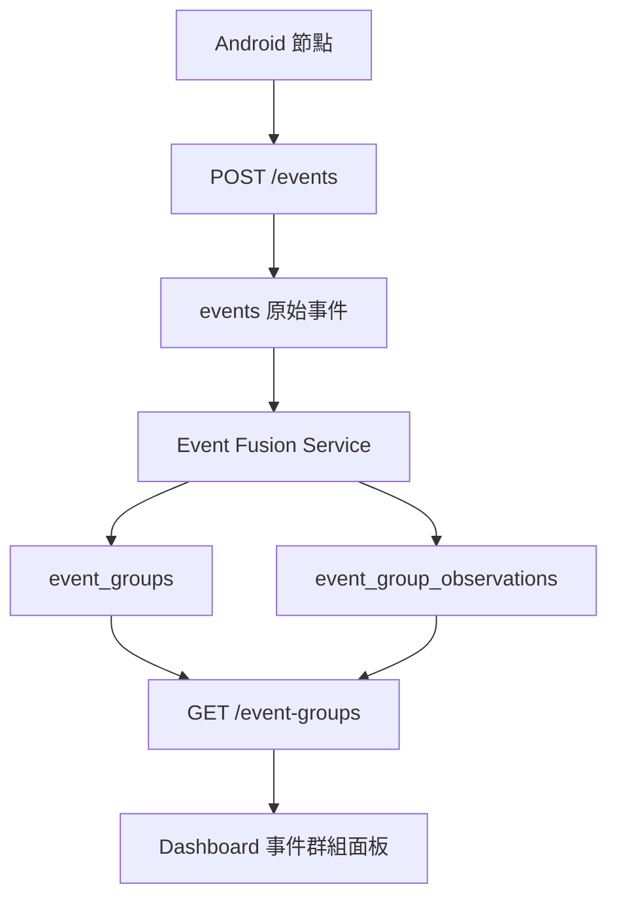

# V3.0 Event Fusion Layer

V3.0 目標是把多台 Android 節點在短時間內送到後端的同類聲音事件，整理成同一個 Event Group。原始 `events` 資料仍完整保留，Event Fusion 只新增群組與觀測關聯。

## Fusion Window

預設融合視窗為 3 秒，可用環境變數 `EVENT_FUSION_WINDOW_SECONDS` 調整。新事件會尋找同 label、狀態為 `ACTIVE`、且 `last_event_time` 距離事件時間不超過視窗的群組。

## Group 規則

- 新群組 `status` 為 `ACTIVE`。
- 新事件會加入時間差最小的候選群組。
- 處理新事件時，明顯超過視窗的舊 `ACTIVE` 群組會被標記為 `CLOSED`。
- `node_count` 使用 `COUNT(DISTINCT device_id)`，同一節點可有多筆 observation，但只算一個節點。
- Event Fusion 失敗不會讓原始 `/events` 上傳失敗。

## 與 V3.1 聲源估測共存

目前 V3.1 聲源估測也使用 `event_groups` 與 `event_group_observations`。為避免互相干擾：

- V3.0 Event Fusion 使用 `group_kind='fusion'` 與 `observation_kind='fusion'`。
- V3.1 聲源估測使用 `group_kind='target_estimate'` 與 `observation_kind='target_estimate'`。
- `/event-groups` 只回傳 `fusion` 群組。
- `/target-estimates` 只回傳 `target_estimate` 群組。

## 未來接入

這一層只負責事件融合，不做定位。未來 Time Sync、TDOA 或 GCC-PHAT 可使用同一個群組的 observations 作為輸入，再把定位結果寫到保留欄位 `estimated_lat`、`estimated_lng`、`localization_method`、`confidence`。
