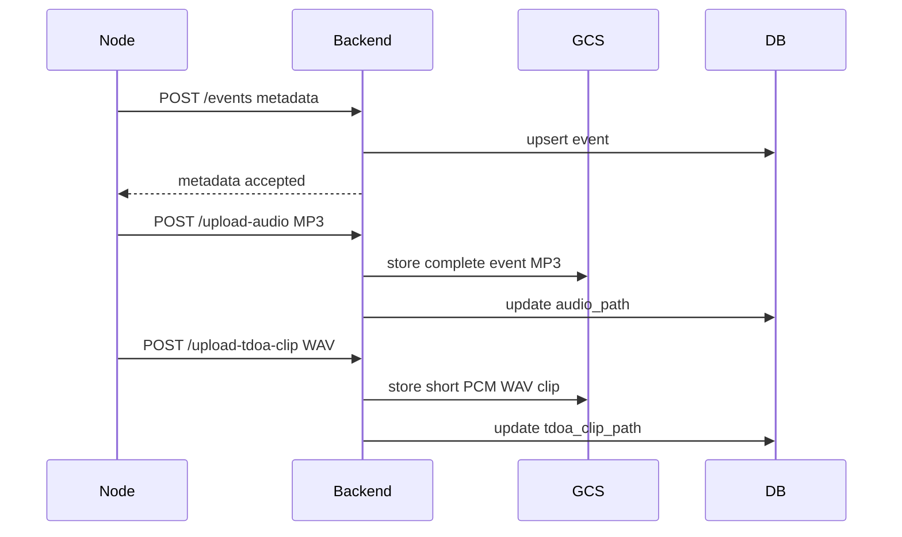

# Event Audio Reliability

Event audio remains separate from live audio.

## Reliable Path

## Current Guarantees

- Event metadata uses idempotent `event_id`.
- MP3 path is for Dashboard playback.
- WAV clip path is for future GCC-PHAT.
- Signed URLs are generated only on request.

## Future Flutter Queue

The final architecture expects an offline upload queue with retry count, checksum, next retry time, and upload state. This pass keeps the existing upload flow and documents the queue requirement.

