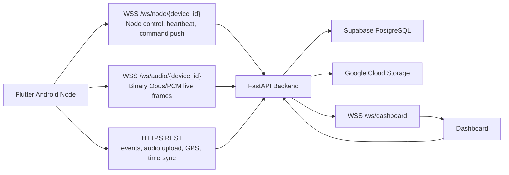

# Final System Architecture

## Backend Services

- `NodeManager`: live node connection state, heartbeat, duplicate connection policy, command delivery.
- `RealtimeCommandService`: WebSocket command push with REST polling fallback.
- `AudioStreamManager`: validates binary frame headers, tracks sequence gaps, backpressure drops, and stream stats.
- `EventFusionService`: groups multiple node observations.
- `LocalizationService`: Timestamp TDOA, GCC-PHAT-ready refinement, hybrid fallback.
- `TrackingService`: target track association and filtered movement state.

## Runtime Channels

- Node Control WebSocket: reliable low-volume control plane.
- Audio WebSocket: best-effort live monitoring plane, not used for TDOA persistence.
- HTTPS REST: reliable metadata, event audio, GPS, Time Sync, and fallback command polling.
- Dashboard WebSocket: live visual update plane.

## Render Constraint

The current realtime managers are in-memory. Use one Render worker. If scaling to multiple workers, add Redis pub/sub or sticky routing.

