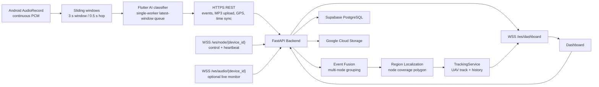

# Final System Architecture

```mermaid
flowchart LR
    Mic["Android AudioRecord<br/>continuous PCM"]
    Window["Sliding windows<br/>3 s window / 0.5 s hop"]
    AI["Flutter AI classifier<br/>single-worker latest-window queue"]
    Rest["HTTPS REST<br/>events, MP3 upload, GPS, time sync"]
    Control["WSS /ws/node/{device_id}<br/>control + heartbeat"]
    LiveAudio["WSS /ws/audio/{device_id}<br/>optional live monitor"]
    Backend["FastAPI Backend"]
    Fusion["Event Fusion<br/>multi-node grouping"]
    Region["Region Localization<br/>node coverage polygon"]
    Track["TrackingService<br/>UAV track + history"]
    Db["Supabase PostgreSQL"]
    Gcs["Google Cloud Storage"]
    DashWs["WSS /ws/dashboard"]
    Dashboard["Dashboard"]

    Mic --> Window --> AI --> Rest --> Backend
    Control --> Backend
    LiveAudio --> Backend
    Backend --> Fusion --> Region --> Track
    Backend --> Db
    Backend --> Gcs
    Backend --> DashWs --> Dashboard
    Track --> DashWs
    Dashboard --> Backend
```

## Android Node

- Uses one continuous `AudioRecord` source at 16 kHz mono PCM16.
- Produces overlapping 3 second windows every 0.5 seconds.
- Runs AI through a single-worker latest-window queue to avoid inference backlog.
- Uploads target metadata first; MP3 evidence upload runs after metadata and is
  allowed to finish later.
- Sends GPS, backend status, time sync state, AI status, and upload states
  separately so one slow path does not hide another path.

## Backend Services

- `NodeManager`: live node connection state, heartbeat, duplicate connection policy, command delivery.
- `RealtimeCommandService`: WebSocket command push with REST polling fallback.
- `AudioStreamManager`: validates binary frame headers, tracks sequence gaps, backpressure drops, and stream stats.
- `EventFusionService`: groups multiple node observations.
- `RegionLocalization`: estimates a coarse area from the reporting node set.
- `LocalizationService`: Timestamp TDOA and GCC-PHAT-ready extension path.
- `TrackingService`: target track association, filtered movement state, and
  history playback data.

## Runtime Channels

- Node Control WebSocket: reliable low-volume control plane.
- Audio WebSocket: best-effort live monitoring plane, not used for TDOA persistence.
- HTTPS REST: reliable metadata, event audio, GPS, Time Sync, and fallback command polling.
- Dashboard WebSocket: live visual update plane.

## Current Stable Positioning Contract

The dashboard's stable live positioning contract is:

1. APP confirms a target sound with AI.
2. APP posts `/events` with device id, label, dB/RMS, timestamp, and location.
3. Backend fuses target events within the event window.
4. Backend creates a coarse region from the unique reporting node positions.
5. Tracking converts consecutive regions into a UAV track with speed, heading,
   and history replay.

This contract prioritizes stable multi-node behavior over meter-level precision.
Timestamp TDOA remains an experimental refinement until real-device time sync and
audio pipeline latency are fully characterized.

## Render Constraint

The current realtime managers are in-memory. Use one Render worker. If scaling to multiple workers, add Redis pub/sub or sticky routing.
