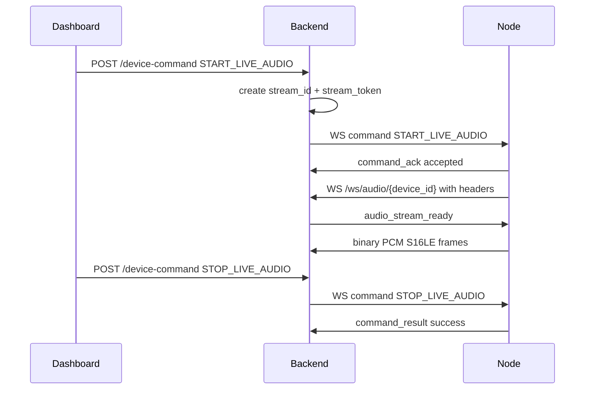
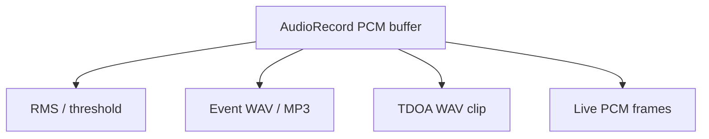

# Live Audio Pipeline

## Codec

Current implemented fallback:

- codec: `pcm_s16le`
- sample rate: 16000 Hz
- channels: mono
- sample width: 16-bit signed little-endian

Opus remains the preferred future codec, but PCM fallback is the implemented interoperable path.

## Audio Capture Fan-Out

Android keeps one `AudioRecord` source:

Live frames are best-effort and are not written to PostgreSQL or GCS.

