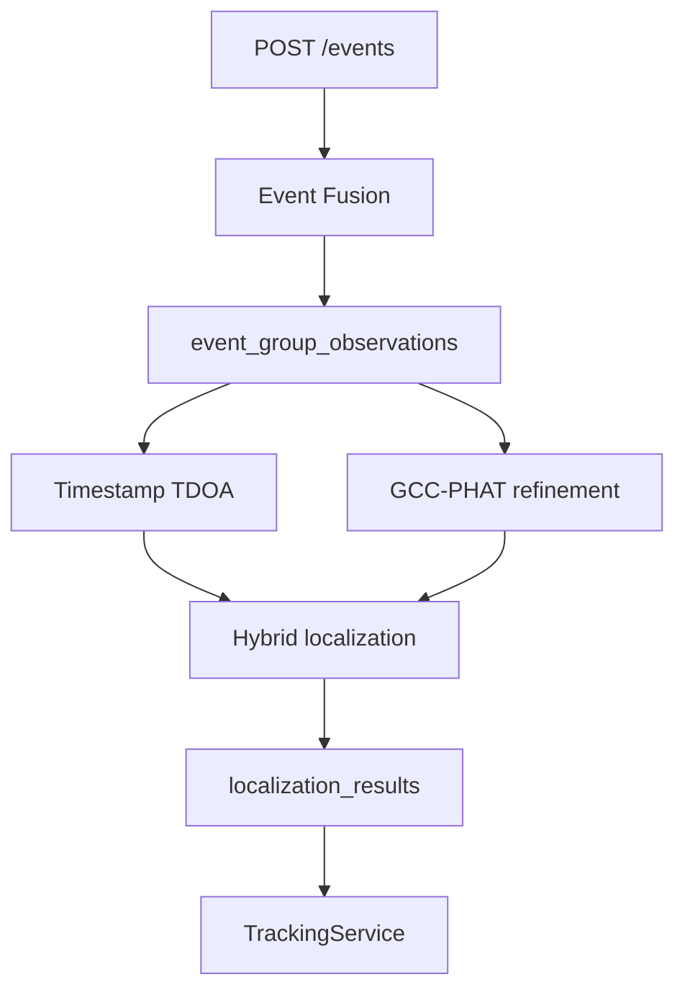

# Localization Architecture

## Pipeline

## Timestamp TDOA

Uses `corrected_arrival_time_ms`, GPS coordinates, speed of sound, and nonlinear least squares over source position and emission time.

## GCC-PHAT

Uses only PCM WAV TDOA clips. MP3 and live Opus are not used for waveform localization.

## Result Fields

- estimated latitude / longitude
- method
- status
- confidence
- residual
- uncertainty radius
- geometry quality
- reference device
- node count
- diagnostics JSON

