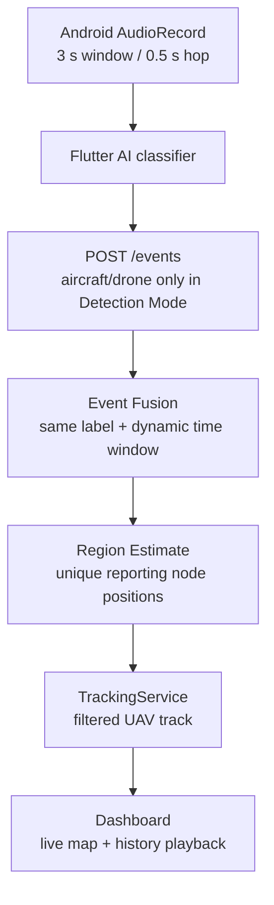

# Localization Architecture

This document describes the current UAV sound source position calculation used
by the V4 dashboard. The production path is a coarse multi-node region estimate
plus target tracking. Timestamp TDOA and GCC-PHAT are kept as architecture
extensions, but they are not the primary stable path for the current demo.

## Current Production Pipeline

```mermaid
flowchart TD
    Audio["Android AudioRecord<br/>3 s window / 0.5 s hop"]
    AI["Flutter AI classifier"]
    Event["POST /events<br/>aircraft/drone only in Detection Mode"]
    Fusion["Event Fusion<br/>same label + dynamic time window"]
    Region["Region Estimate<br/>unique reporting node positions"]
    Track["TrackingService<br/>filtered UAV track"]
    Dashboard["Dashboard<br/>live map + history playback"]

    Audio --> AI --> Event --> Fusion --> Region --> Track --> Dashboard
```

## Region Estimate

The current stable estimate does not infer acoustic distance. It uses the
phones that reported a target sound within the fusion window:

- one reporting node -> single-node diagnostic only
- two reporting nodes -> line segment between the nodes
- three or more reporting nodes -> convex polygon around the reporting nodes
- region center -> polygon centroid or segment midpoint

This is intentionally coarse. It answers "which area is covered by phones that
heard the target sound" rather than "exact meter-level UAV coordinates".

## Tracking

The tracker consumes successful region estimates and keeps a continuous target
state:

- filtered latitude / longitude
- speed in m/s
- heading in degrees
- predicted next position
- history points for replay

Association uses label, time gap, distance gate, uncertainty radius, and a
maximum speed gate so that nearby consecutive estimates become one track instead
of many isolated points.

## Timestamp TDOA Extension

Timestamp TDOA uses `corrected_arrival_time_ms`, fixed node coordinates, speed
of sound, and nonlinear least squares over source position and emission time.
This is available in the backend, but first-version real-device accuracy is
limited by device clock sync, AudioRecord pipeline latency, and model decision
latency.

## GCC-PHAT Extension

GCC-PHAT requires short PCM WAV clips from multiple nodes and cross-correlation
between waveforms. The current MP3-only upload direction means this is not the
active path unless WAV clips are re-enabled for localization experiments.

## Practical Stability Rules

- Prefer fixed node locations over phone GPS when running a multi-node test.
- Use at least 3 reporting nodes for a visible region.
- Keep all nodes on the same APP build and backend URL.
- Use the same Detection / Collection mode on all nodes during a test.
- Treat MP3 upload as evidence playback only; it should not block the map alert.
