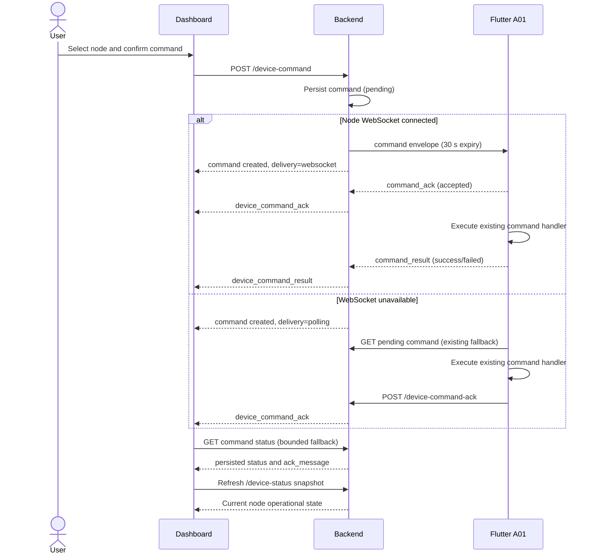

# Dashboard Node Control Flow

Date: 2026-09-01

## Existing command contract

- Create: `POST /device-command`
- Flutter legacy fallback poll: `GET /device-command/{device_id}`
- Dashboard status poll: `GET /device-command/{device_id}?command_id={id}`
- Flutter REST acknowledgement: `POST /device-command-ack`
- Node WebSocket: `/ws/node/{device_id}`
- Dashboard WebSocket: `/ws/dashboard`

The create payload remains:

```json
{
  "device_id": "node_A01",
  "command": "start_listening",
  "value": null,
  "issued_by": "dashboard_v2_4_1"
}
```

V2.4.1 presents only `start_listening`, `stop_listening`,
`set_detection_mode`, and `set_collection_mode`. The Backend also supports
`start_live_audio`, `stop_live_audio`, `request_status`, `sync_time`, and
`update_config`, but they are not promoted into the primary control card.

## Sequence



## State separation

Command UI states are `idle`, `sending`, `pending`, `delivered`,
`ack_success`, `ack_failed`, `timeout`, and `error`. `pending` means the command
exists but has not been proven delivered. `delivered` means WebSocket delivery,
acknowledgement, or execution-in-progress is known. Terminal command status and
node operational state are deliberately separate:

- ACK/result describes that command execution.
- `/device-status` and node status WebSocket updates describe current
  `is_listening` and `upload_mode`.
- The Dashboard never sets node operational fields optimistically.

## Status and timeout semantics

- REST acknowledgement accepts `done` or `failed`.
- Node WebSocket acknowledgement is persisted as `acknowledged`.
- Node WebSocket results are persisted as `running`, `succeeded`, or `failed`.
- A WebSocket command envelope expires after 30 seconds.
- Dashboard fallback polling runs once per second and stops after 30 seconds.
- Device status refresh runs every five seconds to cover heartbeat expiry when
  no final WebSocket disconnect frame is emitted.
- Timeout is a local unresolved presentation state; retry requires a new
  confirmation and the existing Backend supersede behavior handles an older
  pending command.

## Safety and compatibility

- All controls are disabled for offline or missing nodes, Backend disconnect,
  and unresolved in-progress commands.
- Confirmation uses a themed modal with focus containment and Escape cancel.
- Flutter requires no change; the no-query pending poll response is preserved.
- `/dashboard/legacy` remains available.
- V2.4.1 does not expose simulated alerts or fake events.
- Live audio is not enabled on the new control card until its existing
  subscriber flow is validated in isolated staging.
