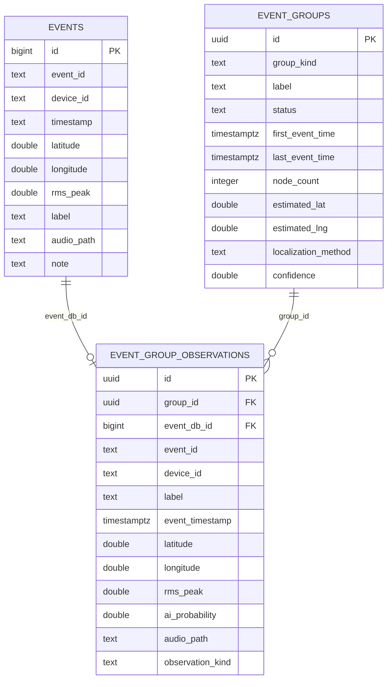

# Event Fusion Database Schema

Migration 檔案：

`C:\sound_backend\migrations\v3_0_event_fusion_tracking.sql`

## 資料表關係



## 欄位映射

目前 `events.id` 是 PostgreSQL `BIGSERIAL` 主鍵，APP 上傳的 `event_id` 是文字欄位。為了不破壞既有 API 與舊資料，`event_group_observations` 同時保留：

- `event_db_id`：對應 `events.id`，可作資料庫 FK。
- `event_id`：對應 APP 送來的事件字串，用於 idempotency 與 Dashboard 顯示。

## Unique 規則

Fusion observation 使用 partial unique index 避免重複融合：

```sql
create unique index if not exists event_group_observations_fusion_event_id_key
    on event_group_observations (event_id)
    where observation_kind = 'fusion';
```

這樣同一個原始事件不會重複加入 Event Fusion 群組，同時不會破壞既有 `target_estimate` 聲源估測資料。

## 索引

- `event_groups(label, status, last_event_time)`
- `event_groups(updated_at desc)`
- `event_group_observations(group_id)`
- `event_group_observations(event_id)`
- `event_group_observations(device_id)`
- `event_group_observations(event_timestamp)`
